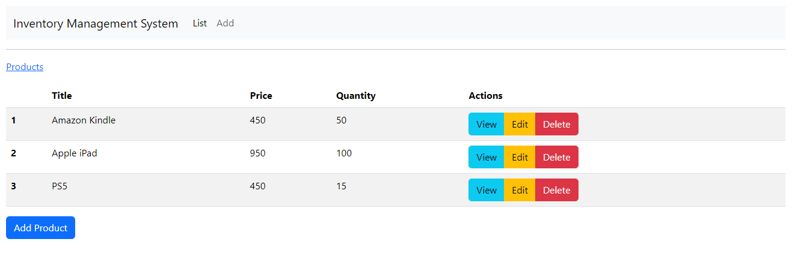
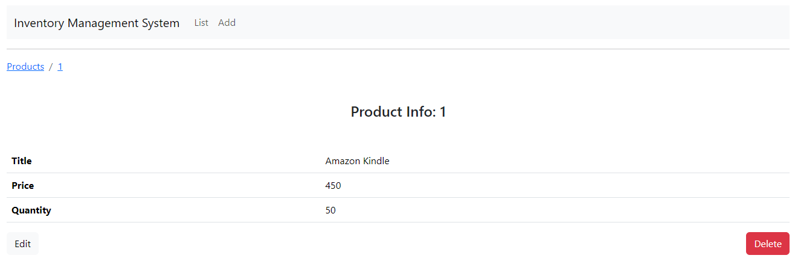
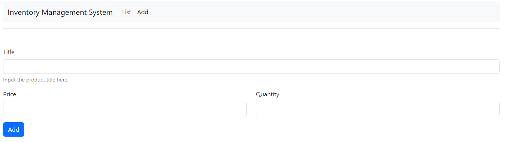
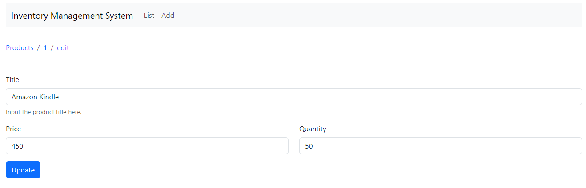

# Inventory Management System

## Overview

> This repository contains an Inventory Management System built using React for the frontend and Spring Boot for the backend. 
>
>> The system allows an inventory manager to view, add, edit, and delete products. Each product has a title, price, and quantity.

### Products

### View Product

### Add Product

### Update Product

